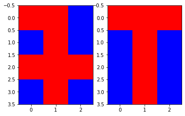

# Python projects

## Hopfield
Program przyjmuje listę wzorców np. literowych po czym uczy sieć do rozpoznawania tych wzorócw metodą fit().
Sieć pracuje w 3 trybach
  1. synchronczny z kolejnością odświeżania od 1
  ```python
    data.predict_sync(example)
    data.show_result(3,4,1)
  ```
  
  
  2. asynchroniczny z podaną kolejnością odświeżania
  3. asynchroniczny z losową kolejnością odświeżania
