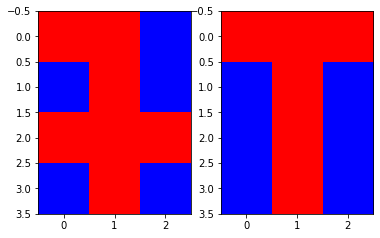
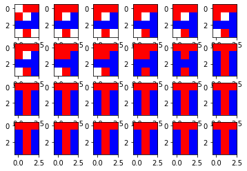
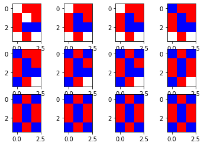

# Python projects

## Hopfield
Program przyjmuje listę wzorców np. literowych po czym uczy sieć do rozpoznawania tych wzorócw metodą fit().
Sieć pracuje w 3 trybach
  1. synchronczny z kolejnością odświeżania od 1
  ```python
    data.predict_sync(example)
    data.show_result(3,4,1)
  ```
  
  
  2. asynchroniczny z podaną kolejnością odświeżania
  ```python
    data.predict_async1(example,[6,1,11,12,2,9,3,5,7,10,4,8,8,11,2,9,7,5,1,4,6,12,3,10])
    data.show_result(3,4,4)
  ```
  
  
  4. asynchroniczny z losową kolejnością odświeżania
  ```python
    data.predict_async2([0, 1, 1, 1, 0, 1, -1, -1, -1, 0, 1, 0])
    data.show_result(3,4,3)
  ```
  
